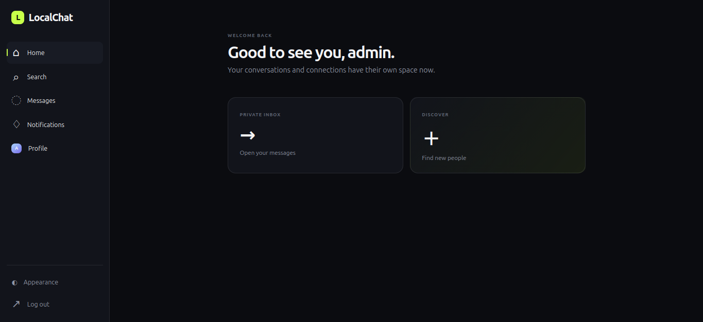
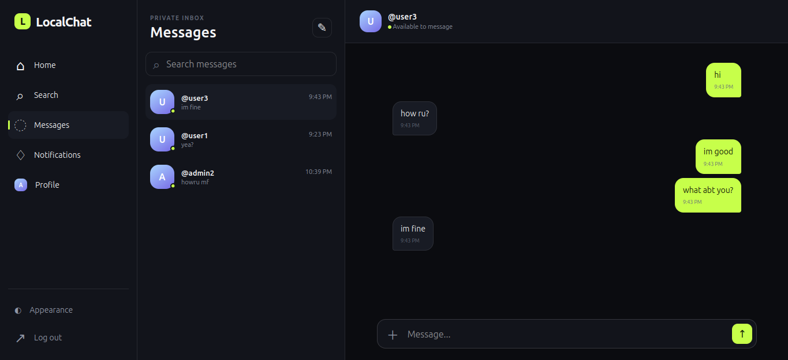

# LocalChat

LocalChat is a private, connection-based web chat application. Users can find people by username, send or accept connection requests, and exchange messages in real time.





## Highlights

- Cookie-based authentication with registration and login
- User search, connection requests, notifications, and profiles
- Dedicated inbox and per-user chat routes
- REST-backed chat history with WebSocket delivery for live messages
- Responsive dark/light interface

## Stack

- Backend: FastAPI, SQLite with `aiosqlite`, Pydantic, PyJWT, and WebSockets
- Frontend: Server-rendered Jinja templates, vanilla JavaScript, and CSS

## Run locally

1. Download the repo using git or downlaod [ZIP](https://github.com/NoneXYZ/FastAPI-WebChat/archive/refs/heads/main.zip) file and extract it.

   ```bash
   git clone git@github.com:NoneXYZ/FastAPI-WebChat.git
   cd FastAPI-WebChat
   ```
   
2. Create and activate a virtual environment.

   ```bash
   python -m venv .venv
   source .venv/bin/activate
   ```

3. Install dependencies.

   ```bash
   pip install -r requirements.txt
   ```

4. [OPTIONAL] Create a `.env` file in the root directory *if you want to configure things like `APP_NAME`, `JWT_SECRET_KEY`, `PORT`, and `DB_FILE_NAME`. Example: .env.example

   *(Note: The `.env` file is git-ignored and should never be committed to version control).*

5. Start the application by running run.py or run app.main using uvicorn.

   ```bash
   python run.py
   ```
   or
   ```bash
   uvicorn app.main:app --port 8000 --reload
   ```

7. Open `http://127.0.0.1:8000`.

You can change the port and app name in frontend and also the db file name and much more in .env

The database is created automatically at the path configured by `DB_FILE_NAME` when the app starts.

## Credits

The backend was made by the project author. The frontend was made by Aider.
